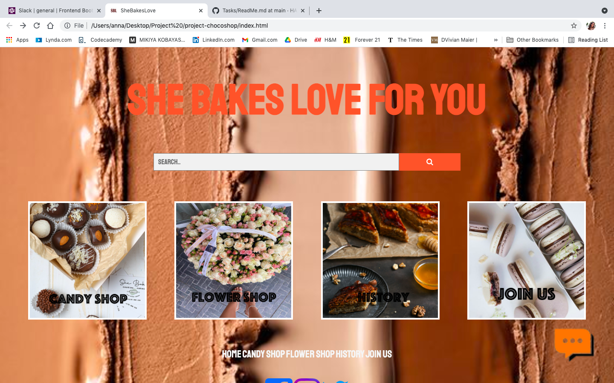
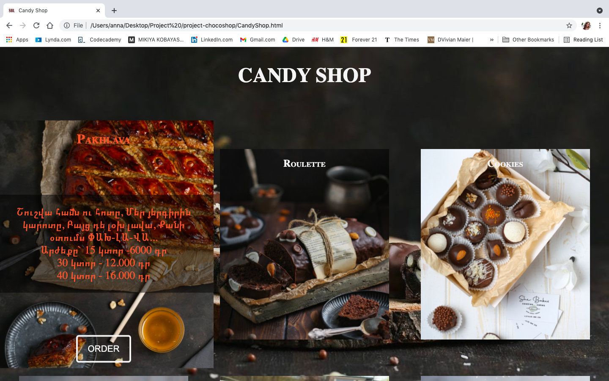
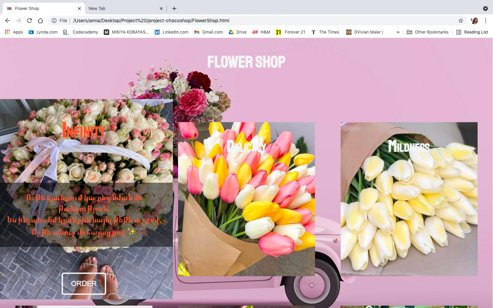
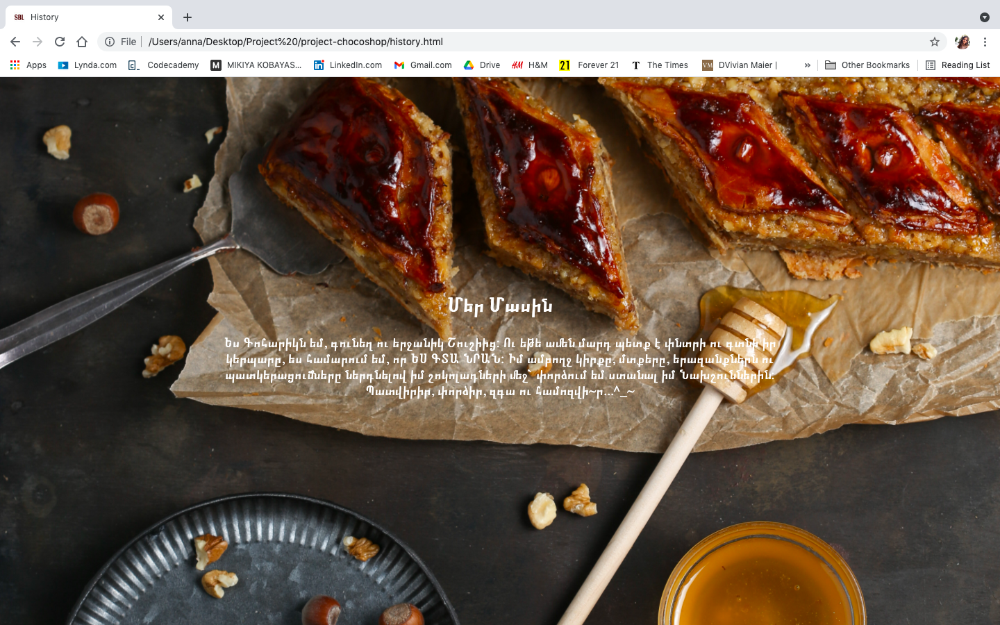

# She Bakes Love
  We decided to work with  real project, where  we can end up and work with customer  whims. And the common type of website is Shop.  And here we are! Our first Shop website sketch. And, don't be unnoticed , that we also had the responsibility of design. 
 ## Main page 
 

As we know the First is the most important. Here we arranged the title "She bakes love" as logo, search input with bottom, four pages with links ( we used nav tag for pages ), chatbox icon, and footer. 

# Candy Shop 

Here we produced the product. During hover you visitors can find the description of product and bottom for Order.

The tiny part of css for hover:

```
.merenga:hover .merengaText {
  visibility: visible;
}
```

# FlowerShop

The structure is the same as Candy shop's.


 # History
 In this page is modest ) 
  It consist of article and background image. 
  

# JoinUs
Here we added a video and websites links. 


That's all :smiley:
 ## Hope you enjoyed it :heart_eyes: